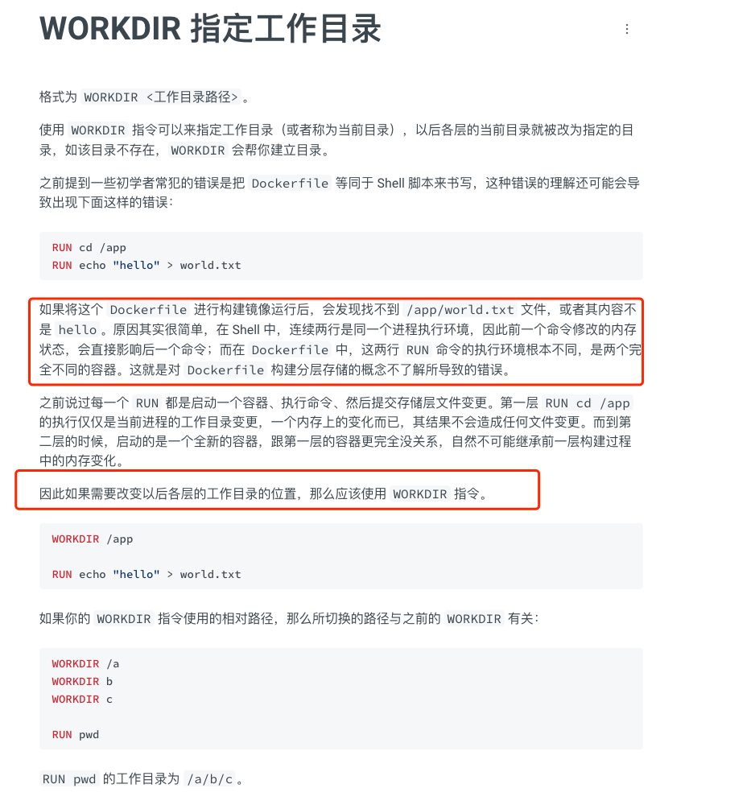

# Dockerfile学习文档：

    文档路径：https://yeasy.gitbook.io/docker_practice/image/dockerfile/workdir
    
    * Dockerfile 是一个文本文件，其内包含了一条条的 指令(Instruction)，每一条指令构建一层，因此每一条指令的内容，就是描述该层应当如何构建。
    * 需要注意的是每个指令会构建一层镜像；

# 怎么理解生成一层镜像的概念：
    1.分层镜像结构:Docker 镜像是由一系列的文件系统层组成，每一层代表一个指令的结果。镜像的每一层都是只读的，上层的镜像可以基于下层镜像进行修改。
    
    2.缓存和指令顺序:在构建 Docker 镜像时，Docker 会尝试使用缓存来提高构建速度。当 Docker 执行一个指令时，它会检查之前的构建是否已经生成了具有相同指令和上下文的层。
    如果存在缓存，Docker 将重用这些缓存的层，而不会重新生成。这就是为什么 Dockerfile 中的指令顺序很重要，因为它会影响缓存的使用。
    
    3."RUN" 指令: "RUN" 指令用于在容器中运行命令。当执行 "RUN" 指令时，Docker 会在当前镜像层的基础上创建一个新的容器层，然后在这个新的容器层中运行指定的命令。
    执行命令的结果将影响新生成的层，这可能包括添加、修改或删除文件、安装软件包等。

    4.层的持久性: 每一层都是只读的，这意味着一旦层被创建，就不能再修改它。每个层都有一个唯一的标识符，通过哈希值表示。
    因此，如果更改了一个已存在的层，将会创建一个全新的层，并且构建过程将生成一个新的镜像 ID。

## FROM 指定基础镜像
    * 所谓定制镜像，那一定是以一个镜像为基础，在其上进行定制，FROM就是指定基础镜像，因此一个 Dockerfile 中 FROM 是必备的指令，并且必须是第一条指令
    * 除了选择现有镜像为基础镜像外，Docker 还存在一个特殊的镜像，名为 scratch。这个镜像是虚拟的概念，并不实际存在，它表示一个空白的镜像，
      因此直接 FROM scratch 会让镜像体积更加小巧，使用  开发的应用很多会使用这种方式来制作镜像，这也是有人认为 Go 是特别适合容器微服务架构的语言的原因之一。
## Run 执行命令
    * RUN 指令是用来执行命令行命令的。由于命令行的强大能力，RUN 指令在定制镜像时是最常用的指令之一。其格式有两种
      * shell 格式：RUN <命令>，就像直接在命令行中输入的命令一样。
        例子：RUN echo '<h1>Hello, Docker!</h1>' > /usr/share/nginx/html/index.html

      * exec 格式：RUN ["可执行文件", "参数1", "参数2"]，这更像是函数调用中的格式
        
      * 需要注意的是：Run指令会创建镜像层，如果10条指令只是为了完成一件事情，应该只用一个Run指令，思想跟代码编写中的高内聚一样；

## 镜像构建上下文（Context）
    * 当在使用 docker build -t springboot-multi-datasource:1.3 . 时，需要跟一个"."符合，它代表的是上下文目录，那什么是上下文目录呢？
      需要理解docker build的工作原理，Docker 在运行时分为 Docker 引擎（也就是服务端守护进程）和客户端工具。Docker 的引擎提供了一组 REST API，被称为 docker remove api，
      而如 docker 命令这样的客户端工具，则是通过这组 API 与 Docker 引擎交互，从而完成各种功能。因此，虽然表面上我们好像是在本机执行各种 docker 功能，但实际上，一切都是使用的远程调用形式在服务端（Docker 引擎）完成。
        
    * docker build 命令构建镜像，其实并非在本地构建，而是在服务端，也就是 Docker 引擎中构建的。那么远程的docker引擎如何获取到本地文件呢？
      这就引入了上下文的概念，当构建的时候，用户会指定构建镜像上下文的路径，docker build 命令得知这个路径后，会将路径下的所有内容打包，然后上传给 Docker 引擎；
      这样 Docker 引擎收到这个上下文包后，展开就会获得构建镜像所需的一切文件。
    
    * 因此在使用docker build .时需要注意 dockerfile所在的项目根目录中是否有大文件，如果有的话使用.dockerignore进行忽略；

# 常用命令：

 ### COPY：
    格式：
        COPY [--chown=<user>:<group>] <源路径>... <目标路径>
        COPY [--chown=<user>:<group>] ["<源路径1>",... "<目标路径>"]
    COPY 指令将从构建上下文目录中 <源路径> 的文件/目录复制到新的一层的镜像内的 <目标路径> 位置
 ### WORKDIR
    使用 WORKDIR 指令可以来指定工作目录（或者称为当前目录），以后各层的当前目录就被改为"指定的目录"，如该目录不存在，WORKDIR 会帮你建立目录。
    可以使得不同层的镜像读取同一目录

### ENV设置环境变量
    设置环境变量，可让后面的指令使用，方便后续维护
    ENV <key> <value>
    ENV <key1>=<value1> <key2>=<value2>...

### EXPOSE暴露端口
    声明容器打算使用什么端口而已，并不会自动在宿主进行端口映射，这只是一个声明，在容器运行时并不会因为这个声明应用就会开启这个端口的服务；

### CMD启动容器命令
    CMD 指令就是用于指定默认的容器主进程的启动命令的
    shell 格式：CMD <命令>
    exec 格式：CMD ["可执行文件", "参数1", "参数2"...]
    参数列表格式：CMD ["参数1", "参数2"...]。在指定了 ENTRYPOINT 指令后，用 CMD 指定具体的参数。
    比如：CMD ["java",  "-jar", "/opt/app.jar"]

# Mavne项目如何打成镜像，并上传到私有仓库里：
    1.docker build -t springboot-multi-datasource:1.4 .  springboot-multi-datasource为镜像名称,1.4为版本号，"."代表上下文
    
    2.docker tag springboot-multi-datasource:1.4 harbor.lan.ctirobot.com/dockerhub/springboot-multi-datasource:1.4
    使用 docker tag 命令将构建好的镜像与私有仓库的地址管关联

    3.docker push harbor.lan.ctirobot.com/dockerhub/springboot-multi-datasource:1.4
    推送到私有仓库的dockerhub目录中，并指定是哪个tag