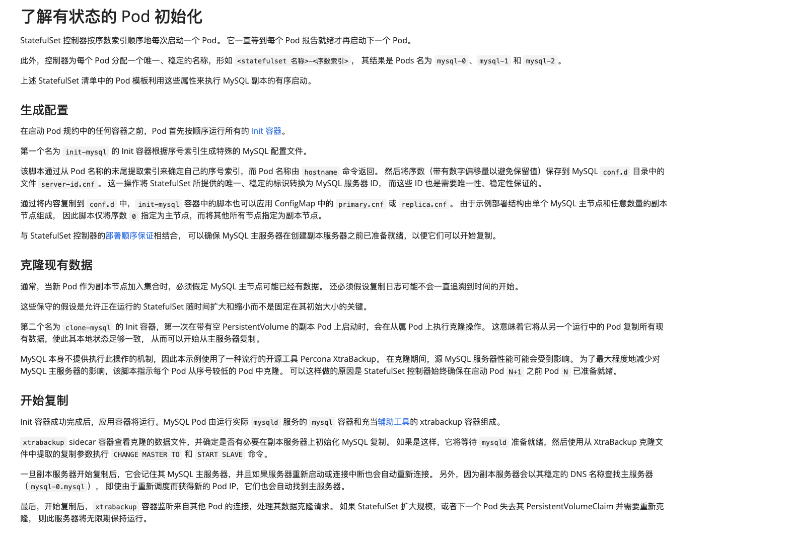

# 配置Mysql主从复制
 * 总体思路：MySQL 示例部署包含一个 ConfigMap、
   三个 Service（mysql服务设置为无头服务，mysql-read作为读服务，mysql-write服务作为对外暴露服务，因为是测试环境没有多余的域名可使用 ，生产上建议使用igress对外暴露，好处是有个稳定的域名） 
   与一个 StatefulSet。

## ConfigMap
```
apiVersion: v1
kind: ConfigMap
metadata:
  name: mysql
  labels:
    app: mysql
    app.kubernetes.io/name: mysql
data:
  primary.cnf: |
    # 仅在主服务器上应用此配置
    [mysqld]
    log-bin    
  replica.cnf: |
    # 仅在副本服务器上应用此配置
    [mysqld]
    super-read-only    
```

## service
```
# 为 StatefulSet 成员提供稳定的 DNS 表项的无头服务（Headless Service）
apiVersion: v1
kind: Service
metadata:
  name: mysql
  labels:
    app: mysql
    app.kubernetes.io/name: mysql
spec:
  ports:
  - name: mysql
    port: 3306
  clusterIP: None
  selector:
    app: mysql
---
# 用于连接到任一 MySQL 实例执行读操作的客户端服务
# 对于写操作，你必须连接到主服务器：mysql-0.mysql
apiVersion: v1
kind: Service
metadata:
  name: mysql-read
  labels:
    app: mysql
    app.kubernetes.io/name: mysql
    readonly: "true"
spec:
  ports:
  - name: mysql
    port: 3306
  selector:
    app: mysql
--- 
# 对外暴露的service，可供数据库工具连接
apiVersion: v1
kind: Service
metadata:
  name: mysql-write
  labels:
    app: mysql
    app.kubernetes.io/name: mysql
spec:
  type: NodePort
  ports:
  - name: mysql
    port: 3306
  selector:
    statefulset.kubernetes.io/pod-name: mysql-0 #需要指定master节点，保障暴露出去的节点可读可写
```

# statefulSet
```
apiVersion: apps/v1
kind: StatefulSet
metadata:
  name: mysql
spec:
  selector:
    matchLabels:
      app: mysql
      app.kubernetes.io/name: mysql
  serviceName: mysql
  replicas: 3
  template:
    metadata:
      labels:
        app: mysql
        app.kubernetes.io/name: mysql
    spec:
      initContainers:
      - name: init-mysql
        image: mysql:5.7
        command:
        - bash
        - "-c"
        - |
          set -ex
          # 基于 Pod 序号生成 MySQL 服务器的 ID。
          [[ $HOSTNAME =~ -([0-9]+)$ ]] || exit 1
          ordinal=${BASH_REMATCH[1]}
          echo [mysqld] > /mnt/conf.d/server-id.cnf
          # 添加偏移量以避免使用 server-id=0 这一保留值。
          echo server-id=$((100 + $ordinal)) >> /mnt/conf.d/server-id.cnf
          # 将合适的 conf.d 文件从 config-map 复制到 emptyDir。
          if [[ $ordinal -eq 0 ]]; then
            cp /mnt/config-map/primary.cnf /mnt/conf.d/
          else
            cp /mnt/config-map/replica.cnf /mnt/conf.d/
          fi          
        volumeMounts:
        - name: conf
          mountPath: /mnt/conf.d
        - name: config-map
          mountPath: /mnt/config-map
        - name: sock
          mountPath: /var/run/mysqld
      - name: clone-mysql
        image: gcr.io/google-samples/xtrabackup:1.0
        command:
        - bash
        - "-c"
        - |
          set -ex
          # 如果已有数据，则跳过克隆。
          [[ -d /var/lib/mysql/mysql ]] && exit 0
          # 跳过主实例（序号索引 0）的克隆。
          [[ `hostname` =~ -([0-9]+)$ ]] || exit 1
          ordinal=${BASH_REMATCH[1]}
          [[ $ordinal -eq 0 ]] && exit 0
          # 从原来的对等节点克隆数据。
          ncat --recv-only mysql-$(($ordinal-1)).mysql 3307 | xbstream -x -C /var/lib/mysql
          # 准备备份。
          xtrabackup --prepare --target-dir=/var/lib/mysql          
        volumeMounts:
        - name: data
          mountPath: /var/lib/mysql
          subPath: mysql
        - name: conf
          mountPath: /etc/mysql/conf.d
        - name: sock
          mountPath: /var/run/mysqld
      containers:
      - name: mysql
        image: harbor.lan.ctirobot.com/dockerhub/mysql:5.7
        env:
        - name: MYSQL_ROOT_PASSWORD
          value: "123456"
        ports:
        - name: mysql
          containerPort: 3306
        volumeMounts:
        - name: data
          mountPath: /var/lib/mysql
          subPath: mysql
        - name: conf
          mountPath: /etc/mysql/conf.d
        - name: sock
          mountPath: /var/run/mysqld          
        resources:
          requests:
            cpu: 500m
            memory: 1Gi
        livenessProbe:
          exec:
            command: ["mysqladmin", "ping"]
          initialDelaySeconds: 30
          periodSeconds: 10
          timeoutSeconds: 5
        readinessProbe:
          exec:
            # 检查我们是否可以通过 TCP 执行查询（skip-networking 是关闭的）。
            command: ["mysql", "-h", "localhost", "-e", "SELECT 1"]
          initialDelaySeconds: 5
          periodSeconds: 2
          timeoutSeconds: 1
      - name: xtrabackup
        image: gcr.io/google-samples/xtrabackup:1.0
        ports:
        - name: xtrabackup
          containerPort: 3307
        command:
        - bash
        - "-c"
        - |
          set -ex
          cd /var/lib/mysql

          # 确定克隆数据的 binlog 位置（如果有的话）。
          if [[ -f xtrabackup_slave_info && "x$(<xtrabackup_slave_info)" != "x" ]]; then
            # XtraBackup 已经生成了部分的 “CHANGE MASTER TO” 查询
            # 因为我们从一个现有副本进行克隆。(需要删除末尾的分号!)
            cat xtrabackup_slave_info | sed -E 's/;$//g' > change_master_to.sql.in
            # 在这里要忽略 xtrabackup_binlog_info （它是没用的）。
            rm -f xtrabackup_slave_info xtrabackup_binlog_info
          elif [[ -f xtrabackup_binlog_info ]]; then
            # 我们直接从主实例进行克隆。解析 binlog 位置。
            [[ `cat xtrabackup_binlog_info` =~ ^(.*?)[[:space:]]+(.*?)$ ]] || exit 1
            rm -f xtrabackup_binlog_info xtrabackup_slave_info
            echo "CHANGE MASTER TO MASTER_LOG_FILE='${BASH_REMATCH[1]}',\
                  MASTER_LOG_POS=${BASH_REMATCH[2]}" > change_master_to.sql.in
          fi

          # 检查我们是否需要通过启动复制来完成克隆。
          if [[ -f change_master_to.sql.in ]]; then
            echo "Waiting for mysqld to be ready (accepting connections)"
            until mysql -h localhost -e "SELECT 1"; do sleep 1; done

            echo "Initializing replication from clone position"
            mysql -h localhost \
                  -e "$(<change_master_to.sql.in), \
                          MASTER_HOST='mysql-0.mysql', \
                          MASTER_USER='root', \
                          MASTER_PASSWORD='123456', \
                          MASTER_CONNECT_RETRY=10; \
                        START SLAVE;" || exit 1
            # 如果容器重新启动，最多尝试一次。
            mv change_master_to.sql.in change_master_to.sql.orig
          fi

          # 当对等点请求时，启动服务器发送备份。
          exec ncat --listen --keep-open --send-only --max-conns=1 3307 -c \
            "xtrabackup --backup --slave-info --stream=xbstream --host=localhost --user=root"          
        volumeMounts:
        - name: data
          mountPath: /var/lib/mysql
          subPath: mysql
        - name: conf
          mountPath: /etc/mysql/conf.d
        - name: sock
          mountPath: /var/run/mysqld          
        resources:
          requests:
            cpu: 100m
            memory: 100Mi
      volumes:
      - name: conf
        emptyDir: {}
      - name: config-map
        configMap:
          name: mysql
      - name: sock
        emptyDir: {}          
  volumeClaimTemplates:
  - metadata:
      name: data
    spec:
      accessModes: ["ReadWriteOnce"]
      resources:
        requests:
          storage: 10Gi

```





#按照过程可能报错：原因是没有开启对外远程连接
```
进入报错容器内，进入mysql
1.运行：GRANT ALL PRIVILEGES ON *.* TO 'root'@'%' IDENTIFIED BY '123456' WITH GRANT OPTION;
2.使用“flush privileges;”命令刷新刚才修改的权限，使其生效。
```
##按照以上步骤创建后
* configMap
  
* service
  
  *statefuset
  
* pod
  
  
#测试是否主从成功
* 进入master-0创建表插入数据,查看其余从节点是否同步成功

#并结合springboot-multi-datasource项目查看代码如何配置