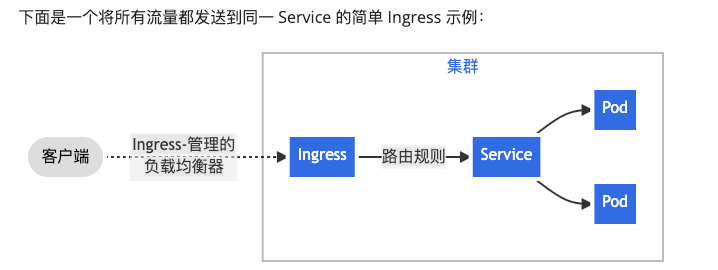

# k8s学习资料

## k8s核心概念：

###Deployment 与 ReplicaSet 和 pod的关系：

* Deployment 是一种高级资源类型，用于声明式地管理应用程序的副本。它提供了一个声明式的方式来描述应用程序的期望状态，包括要运行的 Pod 的数量和模板。
* Deployment 使用 ReplicaSet 来实现副本控制。当您创建一个 Deployment 时，Kubernetes 会自动创建关联的 ReplicaSet，它负责确保在集群中运行指定数量的 Pod 副本，并维护与 Deployment 的期望状态一致
* ReplicaSet：是用于定义Pod副本数量的抽象层。它确保在集群中始终运行指定数量的Pod副本，以保证应用程序的高可用性和可伸缩性。当ReplicaSet的Pod数量与定义的副本数量不一致时，ReplicaSet会自动创建或删除Pod，使得Pod的数量与定义的副本数量保持一致。
* Pod：Pod是Kubernetes中最基本的调度和部署单元。一个Pod是一个或多个容器的集合，它们共享相同的网络命名空间和存储卷。Pod是Kubernetes中最小的可部署对象。

 简单来说 Deployment 用于声明部署策略和管理ReplicaSet副本集，ReplicaSet用于控制Pod副本数量，Pod是部署最小单元；

* 以下一个简单的例子，创建Deployment：

```
apiVersion: apps/v1  #k8s api版本
kind: Deployment     #指定对象类型
metadata:            #元数据
  name: my-nginx     #定义Deployment的名称
spec:                #定于Deployment规格
  selector:          #定义如何选择pod
    matchLabels:     #标签选择器
      run: my-nginx  #选择run: my-nginx的pod
  replicas: 2        #副本数量
  template:          #定义创建pod的模版 
    metadata:        #定义pod的元数据
      labels:        #定义pod的标签
        run: my-nginx
    spec:            #定义pod规格
      containers:    #定义pod中要运行的容器
      - name: my-nginx  #容器名称
        image: nginx    #镜像名称
        ports:          #定义容器要监听的端口
        - containerPort: 80 #表示容器监听的端口是 80
```

* service：创建完deployment后可以直接访问pod，但是pod都是临时的ip地址是会发生变化的，这时就需要创建service，它是将运行在一个或一组Pod上的网络应用程序公开为网络服务的方法。Service充当了Pod的稳定访问入口，可以将流量负载均衡到后端的Pod中，为应用程序提供了一种抽象的方式。
```
apiVersion: v1
kind: Service
metadata:           #定义元数据
  name: my-nginx    #定义service的名称
  labels:           #定义自身的标签
    run: my-nginx
spec:               #定义service的规格
  ports:            #定义service监听的端口
  - port: 80        #port： service的端口号
    targetPort: 80  #targetPort：后端pod的端口号
    protocol: TCP
  selector:         #标签选择器：定义选择那些pod作为关联
    run: my-nginx
```
* EndpointSlice：创建service定义了selector会自动创建EndpointSlice，EndpointSlice定义了网络端点的列表，通常由 Service 引用，以定义可以将流量发送到哪些 Pod；
  EndpointSlice 都由某个 Service 所有， （因为）该端点切片正是为该服务跟踪记录其端点。

### service，EndpointSlice， pod关联关系如何建立：
  * service与pod是通过service的selector进行关联；
  * EndpointSlice 与 Service 的关联是通过 Service 的 Selector 来实现的。当创建 Service 时， 在 Service 的规格（spec）中设置 Selector，定义哪些标签的 Pod 将与这个 Service 关联。
  EndpointSlice Controller 监视着 Service 和 Pod 的变化，一旦 Service 的 Selector 和 Pod 的标签匹配，
  EndpointSlice Controller 就会创建或更新相应的 EndpointSlice，将与 Service 关联的后端 Pod 的 IP 地址和端口信息添加到 EndpointSlice 中。 
    
## k8s内部Service之间访问
    Kubernetes 支持两种查找服务的主要模式：环境变量和 DNS。前者开箱即用，而后者则需要 CoreDNS 集群插件。
    在较新的 Kubernetes 版本中，CoreDNS 通常会作为集群的一部分自动部署； 在kube-system 命名空间中找到kube-dns
## kube-dns应用会自动的给service分配dns名称，可以创建带有curl命令的pod进行测试：
```
kubectl run curl --image=radial/busyboxplus:curl -i --tty --rm

然后，按回车并执行命令 nslookup my-nginx：
Server:    10.96.0.10
Address 1: 10.96.0.10 kube-dns.kube-system.svc.cluster.local

Name:      my-nginx
Address 1: 10.103.194.41 my-nginx.default.svc.cluster.local

然后访问：curl http://my-nginx.default.svc.cluster.loca

会输出以下内容：

<!DOCTYPE html>
<html>
<head>
<title>Welcome to nginx!</title>
<style>
html { color-scheme: light dark; }
body { width: 35em; margin: 0 auto;
font-family: Tahoma, Verdana, Arial, sans-serif; }
</style>
</head>
<body>
<h1>Welcome to nginx!</h1>
<p>If you see this page, the nginx web server is successfully installed and
working. Further configuration is required.</p>

<p>For online documentation and support please refer to
<a href="http://nginx.org/">nginx.org</a>.<br/>
Commercial support is available at
<a href="http://nginx.com/">nginx.com</a>.</p>

<p><em>Thank you for using nginx.</em></p>
</body>
</html>
```
## 保护service(企业部署ssl证书不会与pod关联)
    到现在为止，我们只在集群内部访问了 Nginx 服务器。在将 Service 暴露到因特网之前，我们希望确保通信信道是安全的。 为实现这一目的，需要：
    * 用于 HTTPS 的自签名证书（除非已经有了一个身份证书）
    * 使用证书配置的 Nginx 服务器
    * 使 Pod 可以访问证书的 Secret
操作步骤可参考：https://kubernetes.io/zh-cn/docs/tutorials/services/connect-applications-service/

## 暴露service
    给service设置完ssl证书后，可将service暴露外网ip进行访问；
Kubernetes ServiceTypes 允许指定你所需要的 Service 类型。

可用的 type 值及其行为有：

* ClusterIP：
通过集群的内部 IP 暴露服务，选择该值时服务只能够在集群内部访问。 这也是你没有为服务显式指定 type 时使用的默认值。 你可以使用 Ingress 或者 Gateway API 向公众暴露服务。
* NodePort：
通过每个节点上的 IP 和静态端口（NodePort）暴露服务。 为了让节点端口可用，Kubernetes 设置了集群 IP 地址，这等同于你请求 type: ClusterIP 的服务。
* LoadBalancer：
使用云提供商的负载均衡器向外部暴露服务。 Kubernetes 不直接提供负载均衡组件；它用于在云平台上创建一个外部负载均衡器，并将外部流量通过负载均衡器转发到后端 Pod；
* ExternalName：
将服务映射到 externalName 字段的内容（例如，映射到主机名 api.foo.bar.example）。 该映射将集群的 DNS 服务器配置为返回具有该外部主机名值的 CNAME 记录。 无需创建任何类型代理。
服务 API 中的 type 字段被设计为层层递进的形式 - 每个级别都建立在前一个级别基础上。 并不是所有云提供商都如此严格要求的，但 Kubernetes 的 Service API 设计要求满足这一逻辑。

```
* 总结：service默认的type是ClusterIP可用于集群内部访问，可通过pod的ip加端口或者service的IP加端口访问;
* 类型是NodePord，可根据任意node的ip地址和service的NodePort端口号进行外网访问
* 类型为LoadBalancer 由云提供商（自建）决定如何进行负载平衡，应用场景比如mqtt，kafka，等消息中间件或者gateway服务；
```

## 使用ingress暴露service
```
Ingress 是对集群中服务的外部访问进行管理的 API 对象。
Ingress 是公开从集群外部到集群内服务的 HTTP 和 HTTPS 路由。 流量路由由 Ingress 资源上定义的规则控制。
Ingress 可以提供负载均衡、SSL 终结和基于名称的虚拟托管。
```

* 1.下载Ingress 控制器，常用的ingress-nginx控制器；
* 2 创建IngressClass对象，它的作用是将 Ingress 对象与特定的 Ingress Controller 关联起来；
```
apiVersion: networking.k8s.io/v1
kind: IngressClass
metadata:
  name: my-ingress-class
spec:
  controller: nginx #指定ingress-controller控制器
  
```
* 3.创建Ingress资源
```
apiVersion: networking.k8s.io/v1
kind: Ingress
metadata:
  name: test-ingress
  namespace: schedule-system  
spec:
  ingressClassName: nginx   #指定ingressClass的名称
  rules:
  - host: test.ddd
  - http:
      paths:
      - path: /test
        pathType: Prefix
        backend:
          service:
            name: my-nginx
            port:
              number: 80
```
* 4 配置DNS域名解析（需要实际操作下）
* 5.可根据test.ddd/testpath加上"ingress-nginx"控制器的service端口 访问test服务，常用的nacos可以通过Ingress来暴露服务；

## 无头服务（Headless Services）
```
在不需要k8s负载均衡的情况下，可以使用无头服务，可以通过显式指定 Cluster IP（spec.clusterIP）的值为 "None" 来创建 Headless Service

为什么使用无头服务呢？
普通的service中，它负载的后端pod都是相同的，所以可以使用负载，但是比如redis，mongodb每个pod实例都不同，比如有主从区别，所以不需要负载

通常会与有状态的数据库集群联合使用，比如mongodb集群读写分离，可以通过无头服务来直接连接到数据库的各个节点，而不需要通过负载均衡，
```

#卷
* 重点： 卷的核心是一个目录，其中可能存有数据，Pod 中的容器可以访问该目录中的数据。 所采用的特定的卷类型将决定该目录如何形成的、使用何种介质保存数据以及目录中存放的内容。

容器中的文件在磁盘上是临时存放的，这给在容器中运行较重要的应用带来一些问题。 
当容器崩溃或停止时会出现一个问题。此时容器状态未保存， 因此在容器生命周期内创建或修改的所有文件都将丢失。

使用卷的好处在于：

* 使数据持久化，即使容器重启或迁移，数据也不会丢失。
* 支持容器之间共享数据，方便数据处理和共享状态。
* 解耦数据和容器，使得容器更加易于管理和迁移
* 使用卷时, 在 .spec.volumes 字段中设置为 Pod 提供的卷，并在 .spec.containers[*].volumeMounts 字段中声明卷在容器中的挂载位置。

## 卷类型
* 卷分配临时卷，持久卷
  ### 临时卷：
    * emptyDir：当 Pod 分派到某个节点上时，emptyDir 卷会被创建，并且在 Pod 在该节点上运行期间，卷一直存在。 就像其名称表示的那样，卷最初是空的。
       Pod中的所有容器可以共享emptyDir卷存储；
    * emptyDir作用：一些不想要持久化的文件可以用emptyDir卷，比如不重要的日志文件xxx-job生成的日志；
    * emptyDir卷的生命周期与Pod的生命周期相同，卷的- mountPath: 
    #### 例子：
      ```
      apiVersion: v1
      kind: Pod
      metadata:
      name: redis
      spec:
        containers:
        - name: redis
          image: redis
          volumeMounts:           #定义了将卷挂载到容器内部的配置
          - name: redis-storage   #指定卷名称
            mountPath: /data/redis #决定挂载卷的路径
        volumes:                  #定义在pod中使用的卷
        - name: redis-storage     #指定卷名称要与上面的容器卷名称对应
          emptyDir: {}            #定义卷类型为 emptyDir 跟随pod的声明周期
      ```  
    * 在上面的例子中容器内的/data/redis路径所采用的卷类型是emptyDir临时卷，能够实现与pod同生命周期；
  
  ### 持久卷：
    #### Persistent Volume (PV)（持久卷）:
  ```
        * PV 是一个抽象的资源，代表着集群中的一个存储卷，可以是物理存储、网络存储、云存储等;
        * PV 是集群中的一块存储，可以由管理员事先制备， 或者使用存储类（Storage Class）来动态制备;
        * PV 与实际的存储后端（例如 NFS、iSCSI、云存储提供商等）关联，并定义了存储的属性，如容量、访问模式、回收策略等。
  
    简单来说：PV是一个储藏对象，可以在pv定义一些属性，它与实际存储后端关联。
  ```
    #### Persistent Volume Claim (PVC)（持久卷声明）：
  ```
        * 表达的是用户对存储的请求。概念上与 Pod 类似。 Pod 会耗用节点资源，而 PVC 申领会耗用 PV 资源。Pod 可以请求特定数量的资源（CPU 和内存）；
          同样 PVC 申领也可以请求特定的大小和访问模式。 
  ```
    #### PV与PVC的关系：
  ```
      * 一个PVC是对PV的请求，PVC描述了应用程序对存储资源的需求；
      * PVC与PV之间是自动绑定的，k8s会根据PVC的需求和属性，找到合适的PV进行自动绑定；
  ```
  ### 删除pvc对象：
      当 PersistentVolumeClaim 对象被删除时，PersistentVolume 卷仍然存在，对应的数据卷被视为"已释放（released）"。
      由于卷上仍然存在这前一申领人的数据，该卷还不能用于其他申领。 管理员可以通过下面的步骤来手动回收该卷：
        * 1.除 PersistentVolume 对象。与之相关的、位于外部基础设施中的存储资产 （例如 AWS EBS、GCE PD、Azure Disk 或 Cinder 卷）在 PV 删除之后仍然存在。
        * 2.根据情况，手动清除所关联的存储资产上的数据。
        * 3.手动删除所关联的存储资产。
      如果你希望重用该存储资产，可以基于存储资产的定义创建新的 PersistentVolume 卷对象。
  
  # 在企业级应用中是如何安装中间件：推荐使用helm包管理器，官方文档：https://helm.sh/zh/docs/

  # 在企业级应用中是如何使用持久卷：
    
    ### * PV根据情况创建，当属于静态的存储的资源，可自己创建PV，当需要动态存储的资源可以使用storageClass（存储类）来动态创建PV,当需要存储类时可以使用Longhorn；
    ### * Longhorn 是开源的分布式存储系统，为集群提供可靠，高性能，持久的块存储方案；安装好LongHorn后可以使用它的StorageClass来动态的创建PV；

# ConfigMap：
    configMap是k8s中的对象，用来将非机密性的数据保存到键值对中；可以当作pod的配置文件；其核心意义是配置数据和应用程序解耦；
    可以使用四种方式来使用 ConfigMap 配置 Pod 中的容器
      * 在容器命令和参数内
      * 容器的环境变量
      * 在只读卷里面添加一个文件，让应用来读取
      * 编写代码在 Pod 中运行，使用 Kubernetes API 来读取 ConfigMap

下面是创建一个简单的configMap例子：
```
apiVersion: v1
data:
  special.how: very
kind: ConfigMap
metadata:
  name: special-config
  namespace: ddd
```
使用pod引用：
```
apiVersion: v1
kind: Pod
metadata:
  name: dapi-test-pod
spec:
  containers:
    - name: test-container
      image: registry.k8s.io/busybox
      command: [ "/bin/sh", "-c", "env" ]
      env:
        # 定义环境变量
        - name: SPECIAL_LEVEL_KEY
          valueFrom:
            configMapKeyRef:
              # ConfigMap 包含你要赋给 SPECIAL_LEVEL_KEY 的值
              name: special-config
              # 指定与取值相关的键名
              key: special.how
  restartPolicy: Never    
```
#  Secret:
    Secret 类似于 ConfigMap 但专门用于保存机密数据。
    Pod 可以用三种方式之一来使用 Secret：
     * 作为挂载到一个或多个容器上的卷 中的文件。
     * 作为容器的环境变量。
     * 由 kubelet 在为 Pod 拉取镜像时使用。
简单例子 定义Secret：
```
apiVersion: v1
data:
  redis-password: STJSb0xYWVp3NA==    #格式与configMap类似
kind: Secret
metadata:
  annotations:
    meta.helm.sh/release-name: redis
    meta.helm.sh/release-namespace: ddd
  labels:
    app.kubernetes.io/instance: redis
    app.kubernetes.io/managed-by: Helm
    app.kubernetes.io/name: redis
    helm.sh/chart: redis-17.9.2
  name: redis
  namespace: ddd
type: Opaque  #自定义类型
```
Pod使用Secret：
```
      #在环境变量中引用secret
      containers:
        env:
        - name: REDIS_PASSWORD  #与程序中预留的变量对应
          valueFrom:
            secretKeyRef:
              key: redis-password   #与Secret定义中的key对应
              name: redis
```

# StatefulSet
    StatefulSet 与depolyment类似，但是它主要是用来管理有状态服务；通常搭配无头服务Headless service作为其service
    * 实战中：mqtt，kafka等有状态服务会使用stateFulSet
    

# StatefulSet 与 Deployment的区别
    * 稳定的标识和状态管理：
        Deployment：适用于无状态应用，每个 Pod 都是相互替代的，可以随意被创建和销毁，没有稳定的标识。在更新时，旧的 Pod 会被替换为新的 Pod。
        StatefulSet：适用于有状态应用，每个 Pod 都有唯一的标识和稳定的网络标识符。它们可以有持久性存储，更新时通常一个一个地更新，确保维护应用的状态。
    
    * Pod 的名称和标识：
      Deployment：Pod 的名称通常是随机生成的，并且随着更新会发生变化。
      StatefulSet：Pod 的名称基于指定的名称模板，具有稳定的标识，如 name-0、name-1 等。
    
    * 持久性存储： 
      Deployment：通常用于无状态应用，不保留持久性数据。如果一个 Pod 被销毁，新 Pod 不会继承之前 Pod 的状态。
      StatefulSet：支持有状态应用，可以为每个 Pod 分配唯一的持久性存储。即使 Pod 被重新创建，它仍然会绑定到相同的持久性存储。
    
    * Pod 的更新策略：
      Deployment：通常使用滚动更新策略，即逐步替换旧 Pod 为新 Pod。
      StatefulSet：Pod 更新通常是一个一个地进行，确保有序更新，从而维护应用的状态。

    * 稳定的网络标识符：
      Deployment：Pod 的网络标识符可能在重启后更改，无法保证稳定。
      StatefulSet：每个 Pod 都有稳定的网络标识符，通常通过 Headless Service 实现。

# DaemonSet:
    确保全部（或者某些）节点上运行一个 Pod 的副本。 当有节点加入集群时， 也会为他们新增一个 Pod 。
    当有节点从集群移除时，这些 Pod 也会被回收。删除 DaemonSet 将会删除它创建的所有 Pod。

    DaemonSet 的一些典型用法：
      在每个节点上运行集群守护进程
      在每个节点上运行日志收集守护进程
      在每个节点上运行监控守护进程

    * 实战中prometheus的监听会使用

# CronJob
    定时任务；
    * 实战中可定时运行脚本；

# 亲和性与反亲和性：

  * 亲和性（Affinity）：是一种调度策略，用于指定Pod与那些节点亲近或者与那些Pod亲近，可以使用亲和性将Pod调度到满足特点标签的Node上；
例如，您可以将具有相同标签的一组相关的服务部署到同一个节点上，以减少网络延迟

  * 反亲和性（Anti-Affinity）：用于指定Pod与特定节点的其他Pod分离；
    您可以使用反亲和性来确保一组相关的 Pod 分布在不同的节点上，以提高应用程序的可靠性和冗余性。
    
  * 亲和性和反亲和性都有两个配置：
    * requiredDuringSchedulingIgnoredDuringExecution：调度期间必须满足亲和性条件，但运行期间忽略（硬亲和性）
    * preferredDuringSchedulingIgnoredDuringExecution：调度期间优先尽量满足亲和性条件，但运行期间忽略（软亲和性）
    

例子：
```
apiVersion: v1
kind: Pod
metadata:
  name: with-node-affinity
spec:
  affinity:                                             #亲和性设置
    nodeAffinity:                                       #节点亲和性
      requiredDuringSchedulingIgnoredDuringExecution:   #必须满足
        nodeSelectorTerms:                              #节点选择约束列表
        - matchExpressions:                             #匹配表达式
          - key: topology.kubernetes.io/zone            #Node的标签必须包含topology.kubernetes.io/zone并且值包含antarctica-east1或antarctica-west1
            operator: In
            values:
            - antarctica-east1
            - antarctica-west1
      preferredDuringSchedulingIgnoredDuringExecution:  #尽量匹配
      - weight: 1                                       #权重1
        preference: 
          matchExpressions:
          - key: another-node-label-key                 #节点最后有another-node-label-key并且值包含another-node-label-value
            operator: In
            values:
            - another-node-label-value
  containers:
  - name: with-node-affinity       
    image: registry.k8s.io/pause:2.0
``` 

#污点与容忍度：

  * 污点：可以使节点Node排斥一些Pod；  
  * 容忍度：可以使Pod容忍污点，进而调度到相应污点的Node中
  * 两者结合使用可以使Pod调度到指定的Node中；


# 配置Mysql主从复制

